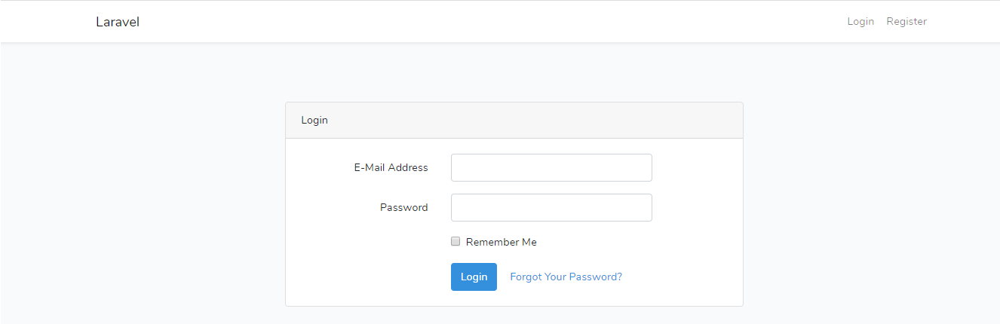

## About Laravel Admin Panel

It is basic laravel admin panel with auth.

## Screenshot
Login Screen

Register Screen

Product Screen

## Security Vulnerabilities

If you discover a security vulnerability within Laravel admin panel, please send an e-mail to Raveesh Yadav via [madhavraveesh@gmail.com](mailto:madhavraveesh@gmail.com). All security vulnerabilities will be promptly addressed.

